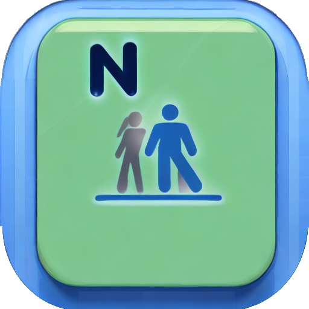

# ShapeTracker
A web app to help you achieve your weight loss goals and track your progress over time.

## Introduction
Are you looking to lose weight and improve your overall health and wellness? ShapeTracker is here to help! This web app, developed by [ParisNeo](https://github.com/ParisNeo) in collaboration with [Assistant](https://openai.com/blog/openai-assistant/), a large language model trained by OpenAI, provides personalized schedules to help you reach your weight loss goals, as well as tools to track your progress over time.

When you first open the app, you will be prompted to select a weight loss plan based on your specific needs and goals. Whether you are looking to lose weight, maintain your current weight, or gain muscle, ShapeTracker has a plan for you. You will also be asked to enter your name, age, and initial weight to help customize your plan.

Once you have selected a plan, you will be taken to the main page of the app. This page includes your schedule for the day, as well as a list input where you can add date-weight couples to track your progress. You can also view a graph that shows your weight evolution over time, and use the links provided to download all of your data as a JSON file or import data from a JSON file.

ShapeTracker is designed with a dark theme and flat buttons, making it easy to use on any device. And, because all of your data is stored locally on your browser, you can be confident that your privacy is protected.

## Features
- Personalized weight loss plans to help you reach your goals
- List input to track your weight over time
- Graph to visualize your weight loss progress
- Links to export and import data as a JSON file
- Dark theme with flat buttons for easy use on any device

## Requirements
- A web browser (such as Chrome, Firefox, or Safari)

## Credits
ShapeTracker was developed by [ParisNeo](https://github.com/ParisNeo) in collaboration with [Assistant](https://openai.com/blog/openai-assistant/), a large language model trained by OpenAI.

We hope ShapeTracker will be a useful and helpful tool in your weight loss journey. If you have any feedback or suggestions, please don't hesitate to let us know.